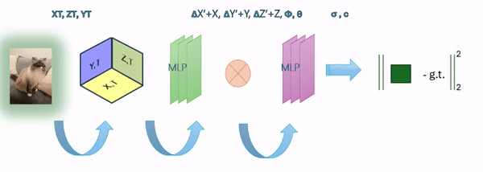
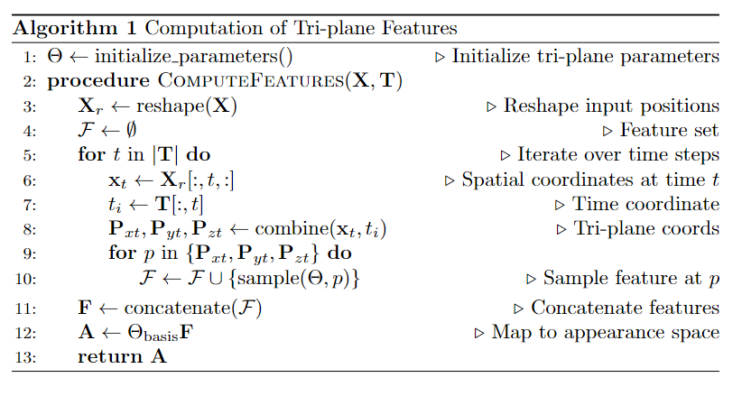

# 4D Scene Reconstruction using Casual Capturing Monocular Camera

## Overview
This Project led by Asrar Alruwayqi aalrwiqi@cs.cmu.edu under the guidance of Prof. Shubham Tulsiani At Carnegie Mellon University, explores innovative methods for 4D scene reconstruction using a casual capturing monocular camera. The goal is to develop a system capable of reconstructing dynamic 3D scenes over time (4D) using simple, everyday equipment.

## Background
Traditional methods for 4D scene reconstruction often require specialized equipment, controlled environments, or multiple cameras, which can be costly and complex. This project seeks to simplify the process, enabling dynamic scene capture in natural, uncontrolled settings with a single camera.

## Methodology

  

## Datasets
We use two datasets in this project:
- **D-Nerf Dataset**: [Download from Dropbox](https://www.dropbox.com/s/0bf6fl0ye2vz3vr/data.zip?e=1&dl=0)
- **iPhone Dataset**: [Access on Google Drive](https://drive.google.com/drive/folders/1cBw3CUKu2sWQfc_1LbFZGbpdQyTFzDEX)

## Installation
      git clone https://github.com/AsrarH/4D-Scene-Reconstruction-using-Casual-Capturing-Monocular-Camera.git
      pip install -r requirements.txt
      python run.py
      
## References and Acknowledgements
This project builds upon the D-NeRF

      @article{pumarola2020d,
        title={D-NeRF: Neural Radiance Fields for Dynamic Scenes},
        author={Pumarola, Albert and Corona, Enric and Pons-Moll, Gerard and Moreno-Noguer, Francesc},
        journal={arXiv preprint arXiv:2011.13961},
        year={2020}
      }

    @article{Cao2023HexPlane,
    author    = {Cao, Ang and Johnson, Justin},
    title     = {HexPlane: A Fast Representation for Dynamic Scenes},
    journal   = {CVPR},
    year      = {2023},
    }
